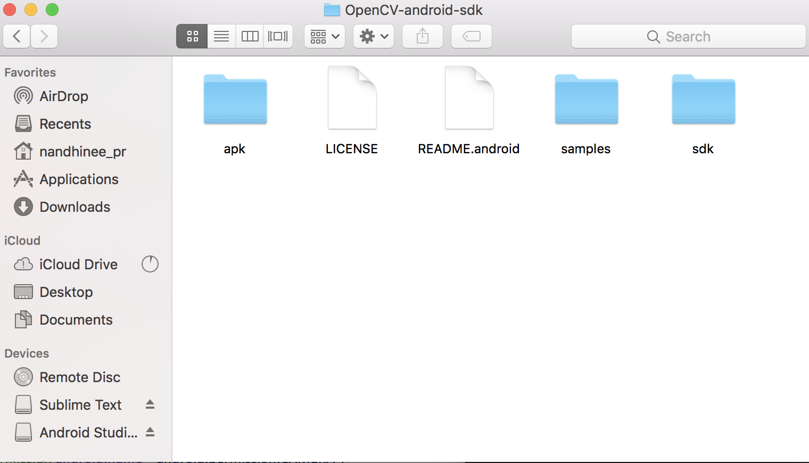
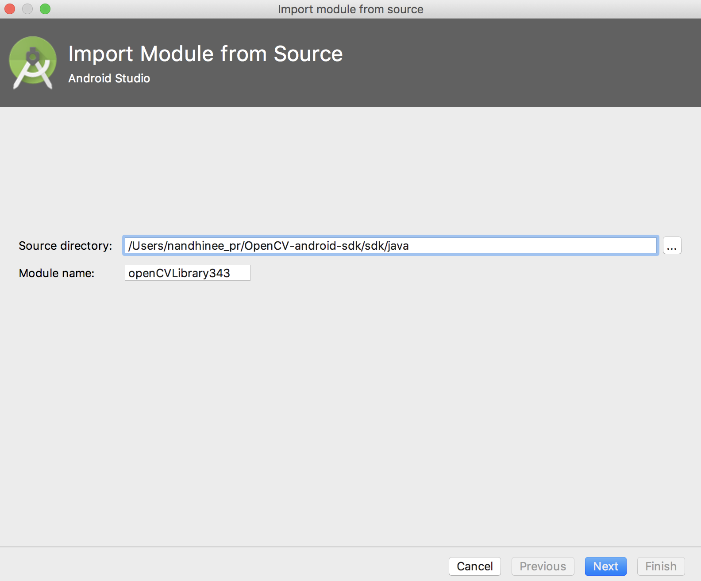
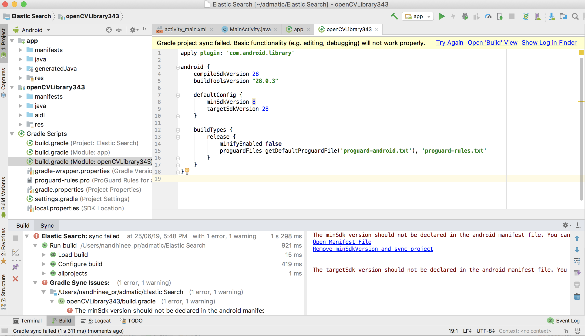
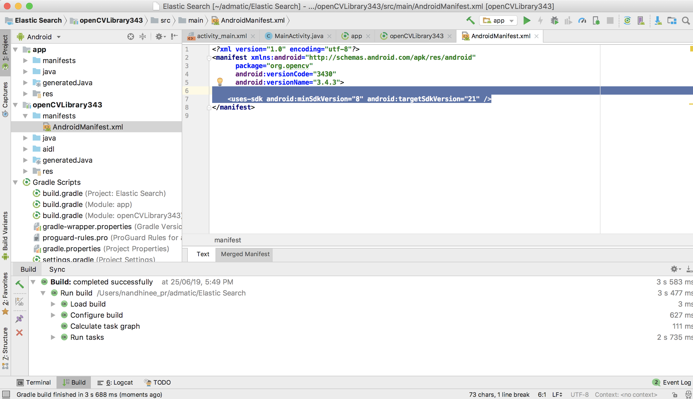
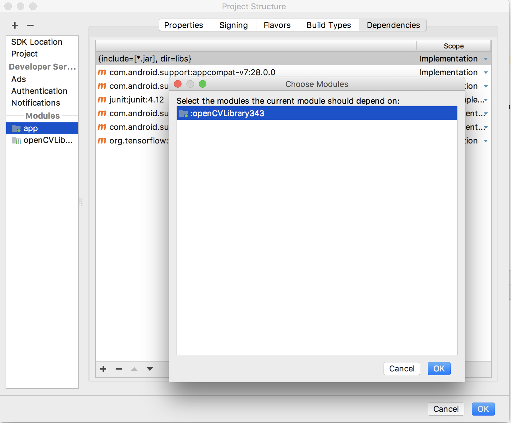
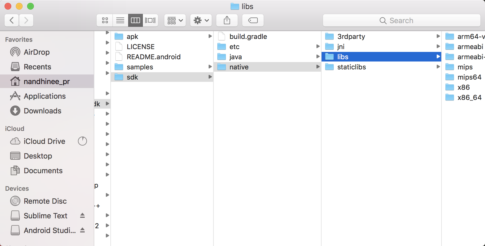
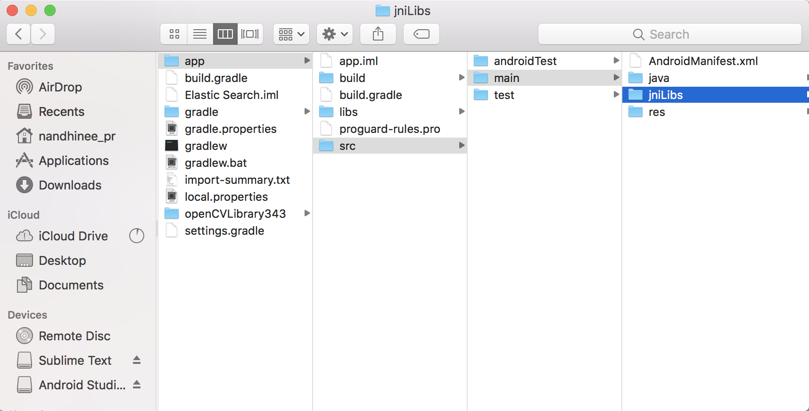
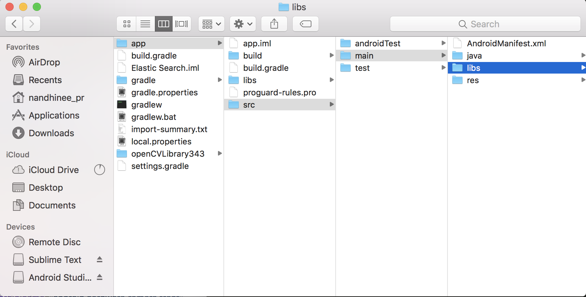
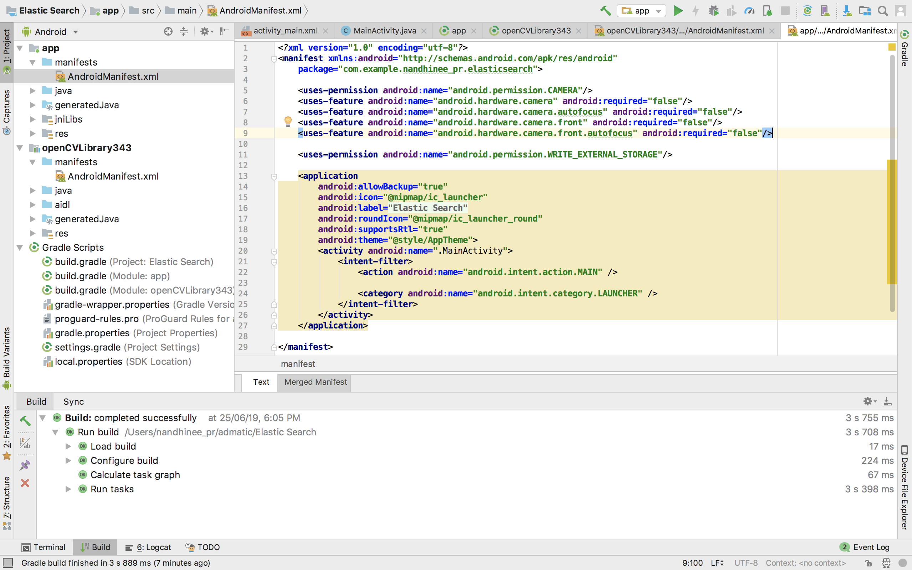

# Setting up OpenCV on Android studio

## Download opencv Library

<p>Download the latest version of OpenCV Library for Android from [OpenCV Android Sourceforge](https://sourceforge.net/projects/opencvlibrary/files/opencv-android/)<br> Extract the zipped files ones the download is complete. The contents of the folder will be as follows. </p>



## Importing OpenCV module

<p>Create a new project in Android Studio and import opencv module. Click on File -> New -> Import Module…<br>Browse to the folder where you extracted the OpenCV Android library zip file contents. Select the java folder inside of the sdk folder. </p>



Click on next and Finish.

## Fixing Gradle Sync Errors

<p>Browse to OpenCV library module and open its build.gradle file. Change compileSdkVersion and targetSdkVersion in the gradle file to the latest Android version supported by your system. In my case, it is 28. </p>



<p>Go to AndroidManifest.xml in the OpenCV library module and remove the line <uses-sdk android:targetSdkVersion="21" /> if it exsists.</p>



## Add OpenCV Dependency

<p>Click on File -> Project Structure. In the app module, on the Dependencies tab select to add module dependency choose and the OpenCV library module.</p>



## Add Native Libraries

<p>Open the sdk folder and then the native folder from folder where you extracted the OpenCV Android library</p>



<p>Copy the libs folder into your (ProjectName/app/src/main).</p>



<p>Rename this folder as jniLibs.</p>



## Add Required Camera and Storage Permissions

<p>In the AndroidManifest.xml of your project module add the following permissions. </p>

```java
    <uses-permission android:name="android.permission.CAMERA"/>

    <uses-feature android:name="android.hardware.camera" android:required="false"/>
    <uses-feature android:name="android.hardware.camera.autofocus" android:required="false"/>
    <uses-feature android:name="android.hardware.camera.front" android:required="false"/>
    <uses-feature android:name="android.hardware.camera.front.autofocus" android:required="false"/>
    <uses-permission android:name="android.permission.WRITE_EXTERNAL_STORAGE"/>

```



**Congrats! You have set up OpenCV Android for your project and now you're good to go!**


