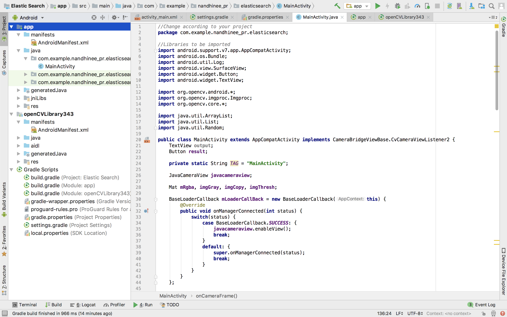
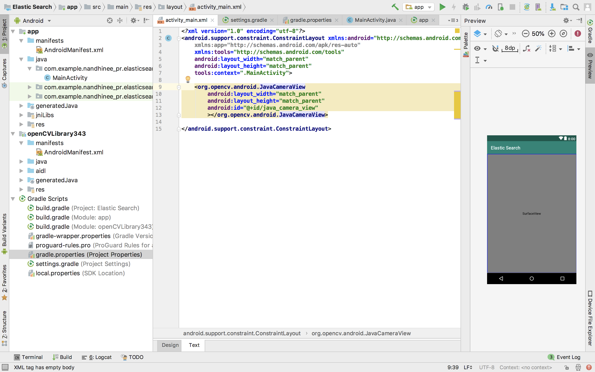
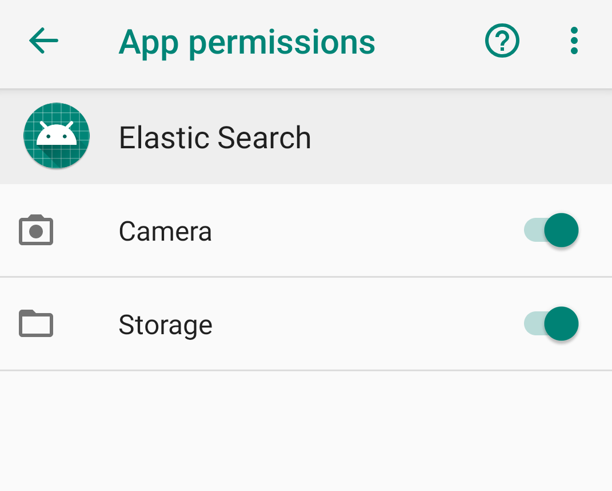
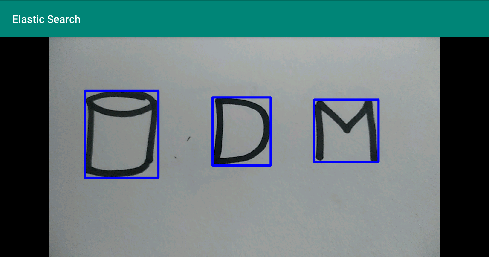

# 2. Finding Contours and their Bounding rectangles on Android studio using OpenCV

## Importing OpenCV libraries and other required libraries

First, follow the steps to set up OpenCV library for android
Import these libraries into MainActivity.java

```java
import android.support.v7.app.AppCompatActivity;
import android.os.Bundle;
import android.util.Log;
import android.view.SurfaceView;
import android.widget.Button;
import android.widget.TextView;

import org.opencv.android.*;
import org.opencv.imgproc.Imgproc;
import org.opencv.core.*;

import java.util.ArrayList;
import java.util.List;
import java.util.Random;
```



## Adding Java Camera View to the UI

<p>In the activity_main.xml add the following lines.</p>

```java
<org.opencv.android.JavaCameraView
        android:layout_width="match_parent"
        android:layout_height="match_parent"
        android:id="@+id/java_camera_view"
        ></org.opencv.android.JavaCameraView>
```


## Main Activity

Copy the following into MainActivity.java.

```java
//Change according to your project
package com.example.nandhinee_pr.elasticsearch;

//Libraries to be imported
import android.support.v7.app.AppCompatActivity;
import android.os.Bundle;
import android.util.Log;
import android.view.SurfaceView;
import android.widget.Button;
import android.widget.TextView;

import org.opencv.android.*;
import org.opencv.imgproc.Imgproc;
import org.opencv.core.*;

import java.util.ArrayList;
import java.util.List;
import java.util.Random;

public class MainActivity extends AppCompatActivity implements CameraBridgeViewBase.CvCameraViewListener2 {
    
    private static String TAG = "MainActivity";

    JavaCameraView javacameraview;

    Mat mRgba, imgGray, imgCopy, imgThresh;

    BaseLoaderCallback mLoaderCallBack = new BaseLoaderCallback(this) {
        @Override
        public void onManagerConnected(int status) {
            switch(status) {
                case BaseLoaderCallback.SUCCESS: {
                    javacameraview.enableView();
                    break;
                }
                default: {
                    super.onManagerConnected(status);
                    break;
                }
            }
        }
    };

    static{

    }

    //Functions for Camera Capture
    @Override
    protected void onCreate(Bundle savedInstanceState) {

        super.onCreate(savedInstanceState);
        setContentView(R.layout.activity_main);

        javacameraview = (JavaCameraView) findViewById(R.id.java_camera_view);
        javacameraview.setVisibility(SurfaceView.VISIBLE);
        javacameraview.setCvCameraViewListener(this);
    }

    @Override
    protected void onPause(){
        super.onPause();
        if(javacameraview!=null)
            javacameraview.disableView();
    }

    @Override
    protected void onDestroy(){
        super.onDestroy();
        if(javacameraview!=null)
            javacameraview.disableView();
    }

    @Override
    protected void onResume(){
        super.onResume();
        if(OpenCVLoader.initDebug()){
            Log.i(TAG, "Opencv Loaded Successfully");
            mLoaderCallBack.onManagerConnected(LoaderCallbackInterface.SUCCESS);
        }
        else{
            Log.i(TAG, "Not Loaded");
            OpenCVLoader.initAsync(OpenCVLoader.OPENCV_VERSION_3_4_0, this, mLoaderCallBack);
        }
    }

    //Initialize the Mat objects here
    @Override
    public void onCameraViewStarted(int width, int height) {
        mRgba = new Mat(height, width, CvType.CV_8UC4);
        imgCopy = new Mat(height, width, CvType.CV_8UC4);
        imgThresh = new Mat(height, width, CvType.CV_8UC1);
        imgGray = new Mat(height, width, CvType.CV_8UC1);

    }

    @Override
    public void onCameraViewStopped() {
        mRgba.release();
    }

    @Override
    public Mat onCameraFrame(CameraBridgeViewBase.CvCameraViewFrame inputFrame) {

    	//Initial frame being read
        mRgba = inputFrame.rgba();

        imgCopy = mRgba.clone();
        //Converting frame to gray scale
        Imgproc.cvtColor(mRgba, imgGray, Imgproc.COLOR_RGB2GRAY);

        //Changing thresholding of the frame. Vary the thresholding from (90-180). Here it is 100
        Imgproc.threshold(imgGray,imgThresh,100,255,Imgproc.THRESH_BINARY_INV);

        //Finding Contours in the frame
        List<MatOfPoint> contours = new ArrayList<MatOfPoint>();
        Random rng = new Random();
        Scalar value = new Scalar( rng.nextInt(1),
                rng.nextInt(1), rng.nextInt(1) );

        Imgproc.findContours(imgThresh, contours, new Mat(), Imgproc.RETR_EXTERNAL,Imgproc.CHAIN_APPROX_SIMPLE);

        //Drawing thebounding rectangles for contours in frame imgCopy
        for (int i = 0; i < contours.size(); i++) {
            Rect rect = Imgproc.boundingRect(contours.get(i));
            if ((rect.height > 50) || (rect.width > 50)) {
                Imgproc.rectangle(imgCopy, rect.tl(), rect.br(), new Scalar(0, 0, 255), 5);
            }

        }

        //Only one frame can be returned at a time. Return imgThresh frame to Check the thresholding. Once thresholding is set, Comment this line.
        //return imgThresh;

        //Frame imgCopy contains the bounding rectangles
        return imgCopy;
    }

}
```

## Enable Permissions in the Virtual device

If you are running the app in your phone, go to Settings -> App permissions -> (Your app name) -> Enable Camera and Storage permissions



## Running Your APP

**When You run your app, this should ideally what your result should look like!**



