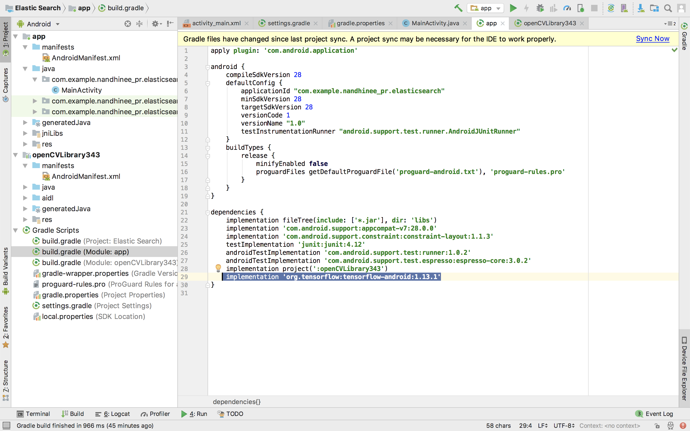
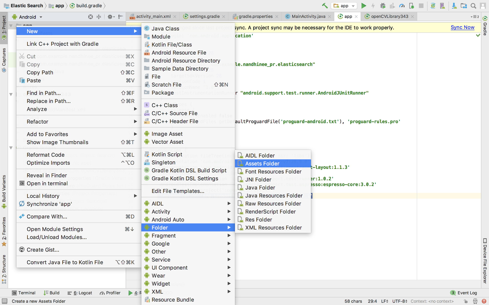
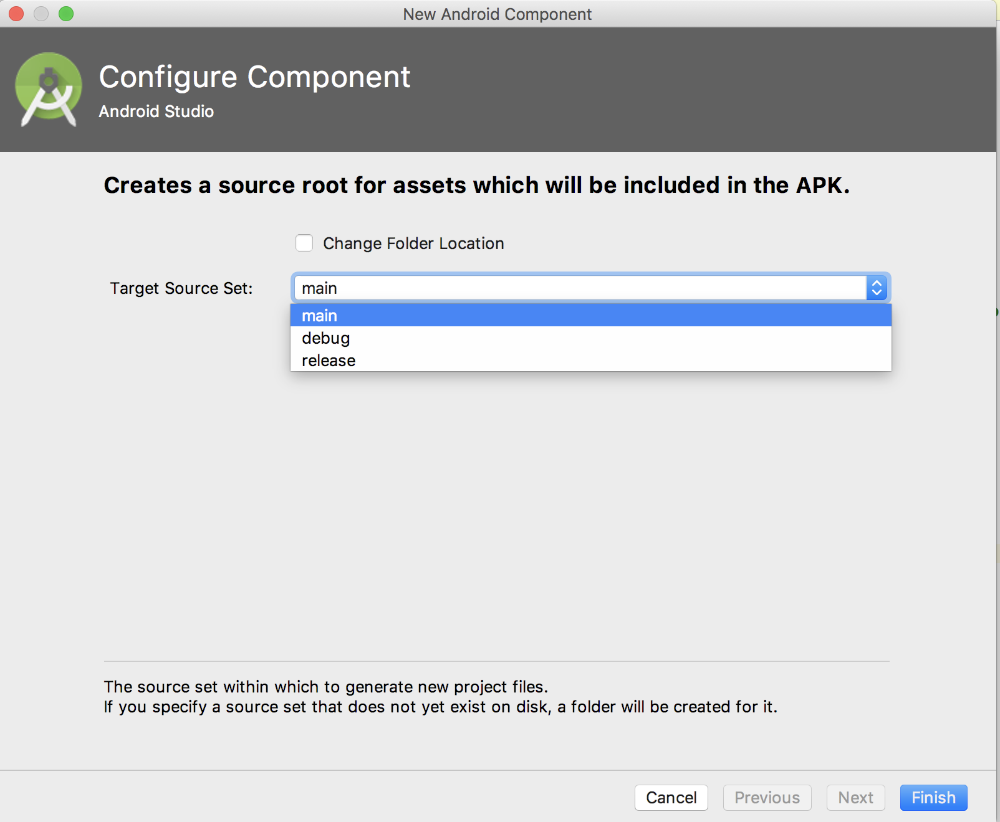
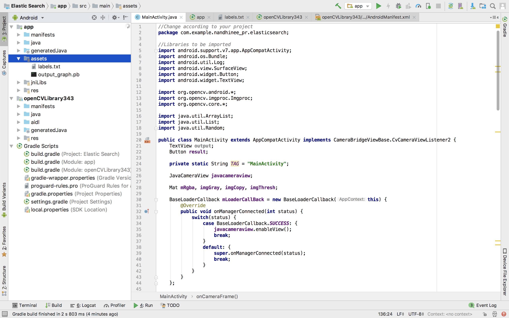
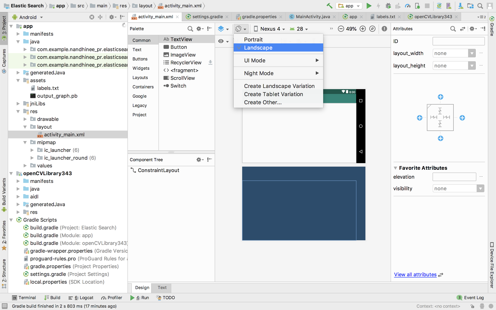
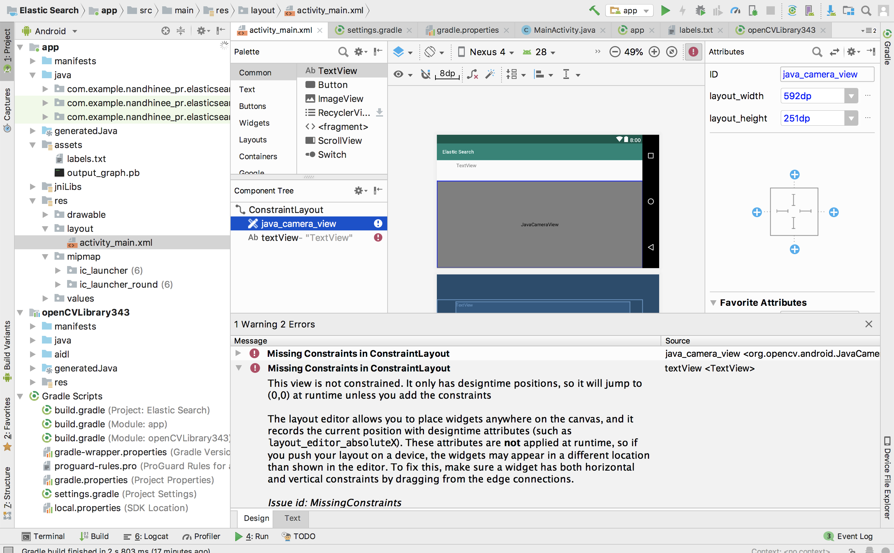
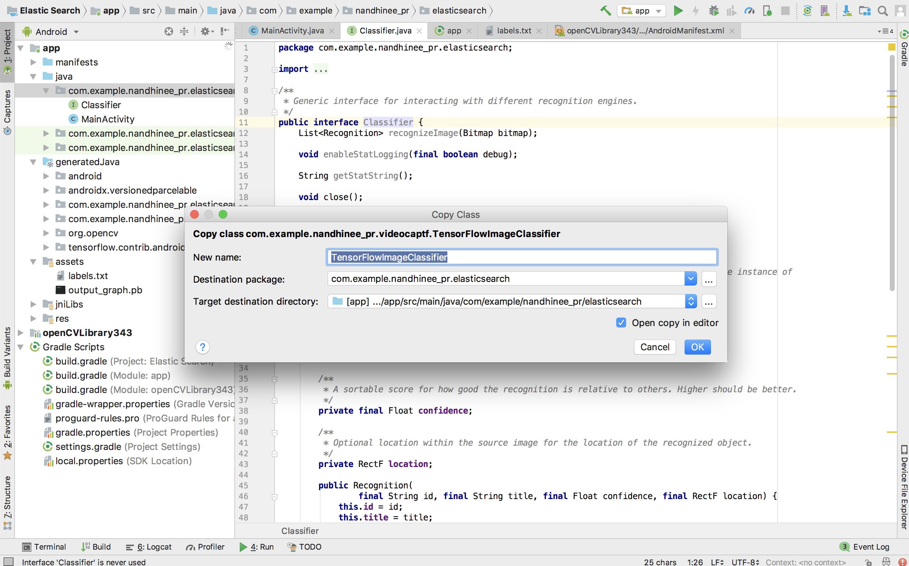
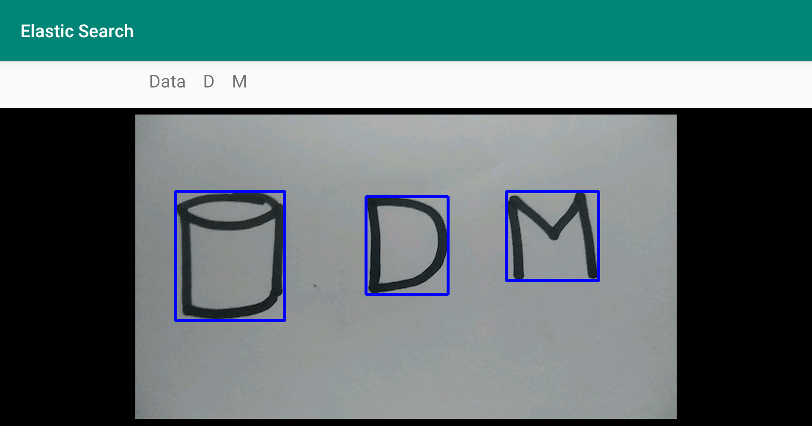

# 3. Classifying the contours using Tensorflow in Android

Before beginning, make sure you have tried the first two modules. 
We are working with classifying contours as Node, D or M.

## Adding Tensorflow dependency

Add the following line to the build.gradle file of the module app.
```
 implementation 'org.tensorflow:tensorflow-android:1.13.1'
```


## Including the Tensorflow graph in Android

Create a new Assets folder. File -> New -> Folder -> Assets folder.



Set the location of the assets folder to main.



In this folder, copy output_graph.pb and labels.txt file. output_graph.pb file contains the tensorflow model in the form of a graph. label.txt file contains the class labels used for classification.



## activity_main.xml

Set the orientation to landscape in the activity_ main.xml.



Copy the following code to activity_main.xml

```
<?xml version="1.0" encoding="utf-8"?>
<android.support.constraint.ConstraintLayout xmlns:android="http://schemas.android.com/apk/res/android"
    xmlns:app="http://schemas.android.com/apk/res-auto"
    xmlns:tools="http://schemas.android.com/tools"
    android:layout_width="match_parent"
    android:layout_height="match_parent"
    tools:context=".MainActivity"
    tools:layout_editor_absoluteY="73dp">

    <org.opencv.android.JavaCameraView
        android:id="@+id/java_camera_view"
        android:layout_width="0dp"
        android:layout_height="251dp"
        app:layout_constraintBottom_toBottomOf="parent"
        app:layout_constraintEnd_toEndOf="parent"
        app:layout_constraintStart_toStartOf="parent"></org.opencv.android.JavaCameraView>

    <TextView
        android:id="@+id/output"
        android:layout_width="503dp"
        android:layout_height="58dp"
        android:layout_marginTop="6dp"
        android:layout_marginEnd="33dp"
        android:text="TextView"
        app:layout_constraintEnd_toEndOf="parent"
        app:layout_constraintTop_toTopOf="parent" />


</android.support.constraint.ConstraintLayout>
```
In case the folllowing error comes up 'Missing constraits in constraint layout', click on the infer constraint button.



## Java files used for classification

Copy Classifier.java and TensorFlowImageClassifier.java into app -> src -> main -> java as follows. 



## MainActivity.java

<p>From the graph_def_for_reference.pb.ascii fing the INPUT_NAME and the OUTPUT_NAME. INPUT_NAME corresponds to the name of the first input layer. OUTPUT_NAME corresponds to the name of the output layer. Here INPUT_NAME is conv2d_1_input and OUTPUT_NAME is out_0.
<br> Location of the output graph is given in MODEL_FILE and location of labels.txt file is given in LABEL_FILE.

<br><br>Copy the following into MainActivity.java</p>

```java
//Change according to your project
package com.example.nandhinee_pr.elasticsearch;

//Libraries to be imported
import android.content.Intent;
import android.graphics.Bitmap;
import android.os.Environment;
import android.support.v7.app.AppCompatActivity;
import android.os.Bundle;
import android.util.Log;
import android.view.SurfaceView;

import android.widget.TextView;

import org.opencv.android.*;
import org.opencv.imgcodecs.Imgcodecs;
import org.opencv.imgproc.Imgproc;
import org.opencv.core.*;

import java.io.File;
import java.io.FileOutputStream;
import java.util.ArrayList;
import java.util.HashMap;
import java.util.List;
import java.util.Map;
import java.util.Random;
import java.util.TreeMap;

public class MainActivity extends AppCompatActivity implements CameraBridgeViewBase.CvCameraViewListener2 {
    TextView output;

    private static String TAG = "MainActivity";

    JavaCameraView javacameraview;

    Mat mRgba, imgGray, imgCopy, imgThresh, croppedImg;

    BaseLoaderCallback mLoaderCallBack = new BaseLoaderCallback(this) {
        @Override
        public void onManagerConnected(int status) {
            switch(status) {
                case BaseLoaderCallback.SUCCESS: {
                    javacameraview.enableView();
                    break;
                }
                default: {
                    super.onManagerConnected(status);
                    break;
                }
            }
        }
    };

    static{

    }


    public String res = "";

    private static final int INPUT_SIZE = 28;
    private static final int IMAGE_MEAN = 0;
    private static final float IMAGE_STD = 255;
    private static final String INPUT_NAME = "conv2d_1_input";
    private static final String OUTPUT_NAME = "out_0";
    private static final String MODEL_FILE = "file:///android_asset/output_graph.pb";
    private static final String LABEL_FILE =
            "file:///android_asset/labels.txt";

    //Initialising the classifier
    private Classifier classifier;
    
    //Functions for Camera Capture
    @Override
    protected void onCreate(Bundle savedInstanceState) {

        super.onCreate(savedInstanceState);
        setContentView(R.layout.activity_main);

        output = (TextView) findViewById(R.id.output);

        javacameraview = (JavaCameraView) findViewById(R.id.java_camera_view);
        javacameraview.setVisibility(SurfaceView.VISIBLE);
        javacameraview.setCvCameraViewListener(this);

        try {
            classifier =
                    TensorFlowImageClassifier.create(
                            getAssets(),
                            MODEL_FILE,
                            LABEL_FILE,
                            INPUT_SIZE,
                            IMAGE_MEAN,
                            IMAGE_STD,
                            INPUT_NAME,
                            OUTPUT_NAME);
        } catch (Exception e) {
            Log.e(TAG, e.toString());
        }
    }

    @Override
    protected void onPause(){
        super.onPause();
        if(javacameraview!=null)
            javacameraview.disableView();
    }

    @Override
    protected void onDestroy(){
        super.onDestroy();
        if(javacameraview!=null)
            javacameraview.disableView();
    }

    @Override
    protected void onResume(){
        super.onResume();
        if(OpenCVLoader.initDebug()){
            Log.i(TAG, "Opencv Loaded Successfully");
            mLoaderCallBack.onManagerConnected(LoaderCallbackInterface.SUCCESS);
        }
        else{
            Log.i(TAG, "Not Loaded");
            OpenCVLoader.initAsync(OpenCVLoader.OPENCV_VERSION_3_4_0, this, mLoaderCallBack);
        }
    }

    //Initialize the Mat objects here
    @Override
    public void onCameraViewStarted(int width, int height) {
        mRgba = new Mat(height, width, CvType.CV_8UC4);
        imgCopy = new Mat(height, width, CvType.CV_8UC4);
        imgThresh = new Mat(height, width, CvType.CV_8UC1);
        imgGray = new Mat(height, width, CvType.CV_8UC1);
        croppedImg = new Mat(height, width, CvType.CV_32FC4);
    }

    @Override
    public void onCameraViewStopped() {
        mRgba.release();
    }

    private void setText(final TextView output, final String value){
        runOnUiThread(new Runnable() {
            @Override
            public void run() {
                //Log.i(TAG, "RES: " + value);
                output.setText(value);
            }
        });
    }

    @Override
    public Mat onCameraFrame(CameraBridgeViewBase.CvCameraViewFrame inputFrame) {

        //Initial frame being read
        mRgba = inputFrame.rgba();

        imgCopy = mRgba.clone();
        //Converting frame to gray scale
        Imgproc.cvtColor(mRgba, imgGray, Imgproc.COLOR_RGB2GRAY);

        //Changing thresholding of the frame. Vary the thresholding from (90-180)
        Imgproc.threshold(imgGray,imgThresh,100,255,Imgproc.THRESH_BINARY_INV);

        //Finding Contours in the frame
        List<MatOfPoint> contours = new ArrayList<MatOfPoint>();
        Random rng = new Random();
        Scalar value = new Scalar( rng.nextInt(1),
                rng.nextInt(1), rng.nextInt(1) );

        Imgproc.findContours(imgThresh, contours, new Mat(), Imgproc.RETR_EXTERNAL,Imgproc.CHAIN_APPROX_SIMPLE);

        HashMap<Integer, String> map1 = new HashMap<Integer, String>();
        int xval;

        for(int i=0; i< contours.size();i++)
        {
            Rect rect = Imgproc.boundingRect(contours.get(i));
            if ((rect.height > 50) || (rect.width > 50))
            {
                xval = rect.x;
                croppedImg = new Mat(mRgba, rect);
                Core.copyMakeBorder(croppedImg, croppedImg, 40,40,40,40, Core.BORDER_CONSTANT,value);
                Imgproc.threshold(croppedImg,croppedImg,110,255,Imgproc.THRESH_BINARY_INV);

                Size sz = new Size(28, 28);
                Imgproc.resize(croppedImg,croppedImg, sz );
                Imgproc.threshold(croppedImg,croppedImg,254,255,Imgproc.THRESH_BINARY_INV);

                File path = new File(Environment.getExternalStorageDirectory() + "/Images/");
                path.mkdirs();
                File file = new File(path, "croppedImage.jpeg");
                File file1 = new File(path, "processed.jpeg");

                String filename = file.toString();
                String filename1 = file1.toString();


                Boolean bool = Imgcodecs.imwrite(filename, croppedImg);

                Imgproc.rectangle(imgCopy, rect.tl(), rect.br(), new Scalar(0, 0, 255), 5);

                //Running the classifier for each contour
                if (classifier != null) {
                    try {
                        Bitmap bmp = Bitmap.createBitmap(croppedImg.cols(), croppedImg.rows(), Bitmap.Config.ARGB_8888);
                        Utils.matToBitmap(croppedImg, bmp);

                        try (FileOutputStream out = new FileOutputStream(filename1)) {
                            bmp.compress(Bitmap.CompressFormat.PNG, 100, out);
                            out.flush();
                            out.close();
                        } catch (Exception e) {
                            Log.e(TAG, e.toString());
                        }

                        final List<Classifier.Recognition> results = classifier.recognizeImage(bmp);

                        if (results != null && results.size() > 0) {
                            Classifier.Recognition recognition = results.get(0);
                            if (recognition != null) {
                                if (recognition.getTitle() != null && recognition.getConfidence() != null) {
                                    //Log.e(TAG, i + ": " + recognition.getTitle() + '\t' + String.format("%.2f", (100 * recognition.getConfidence())) + "%");
                                    map1.put(xval, recognition.getTitle());
                                }
                            }
                        }
                    } catch (Exception e) {
                        //Log.d(TAG, "exception caught");
                    }
                }
                else{
                    Log.d(TAG, "Classifier NULL");
                }

            }

        }
        Map<Integer, String> treeMap = new TreeMap<>(map1);

        res = "";
        for (Map.Entry<Integer,String> entry : treeMap.entrySet()){
            res = res + "    "  + entry.getValue();
        }
        //Log.i(TAG, "Result: " + res);

        setText(output, res);

        //Only one frame can be returned at a time. Return imgThresh frame to Check the thresholding. Once thresholding is set, Comment this line.
        //return imgThresh;

        //Frame imgCopy contains the bounding rectangles
        return imgCopy;
    }

}
```

**Congrats, you've reached the end. If you've followed the above steps, you're app should be working good and look something like this.**




